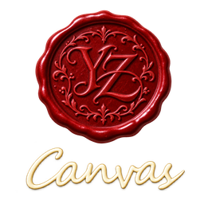
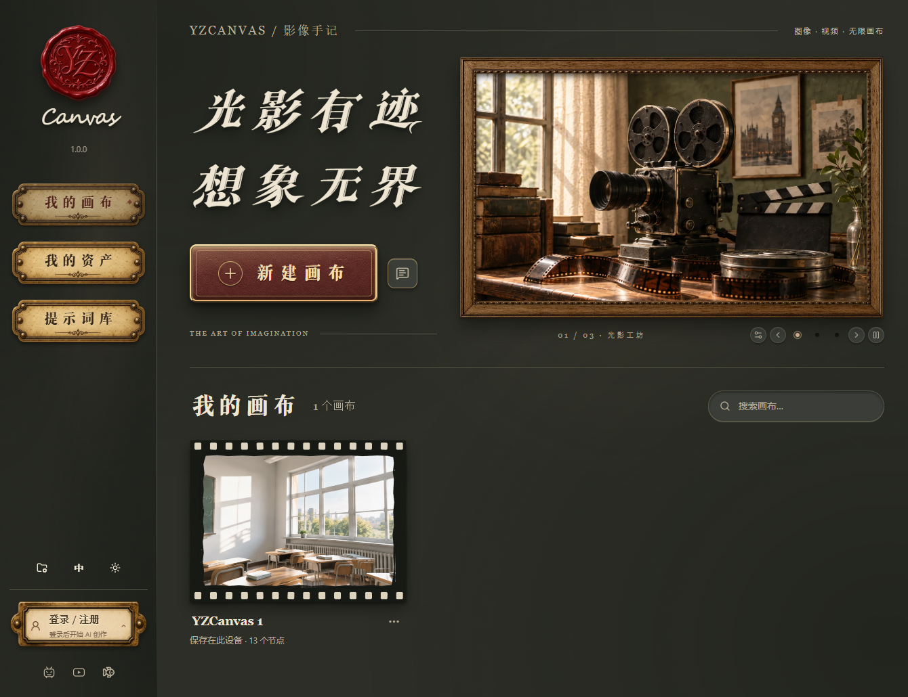
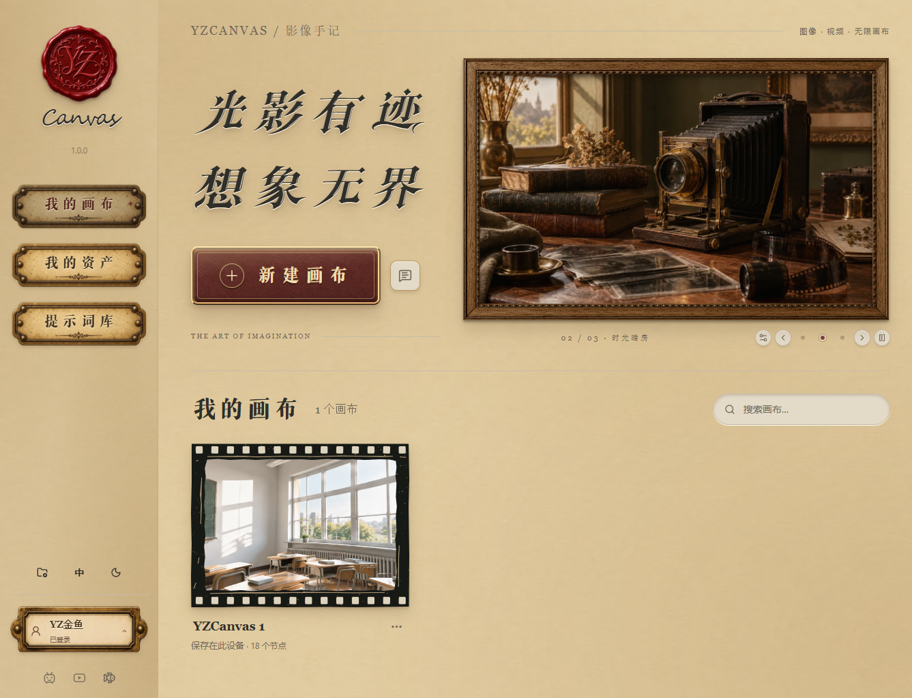
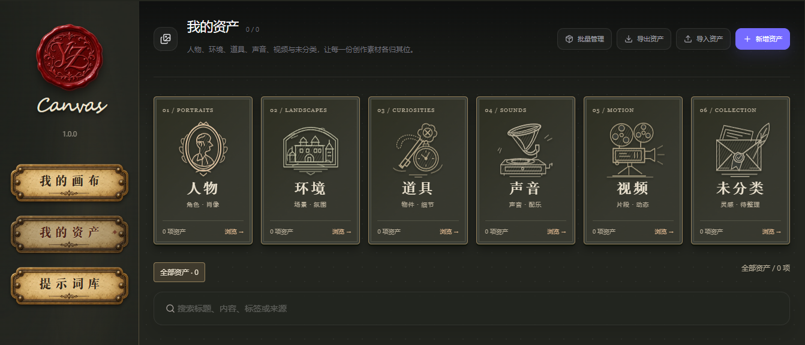
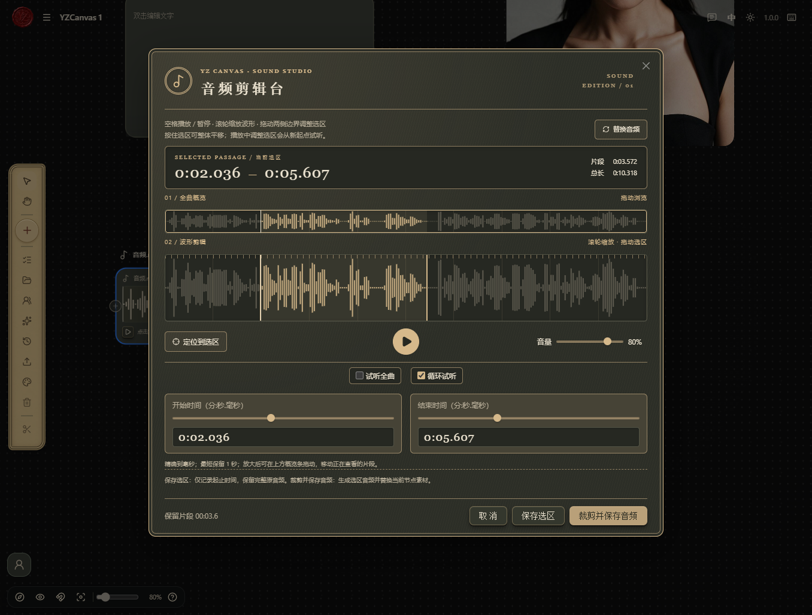
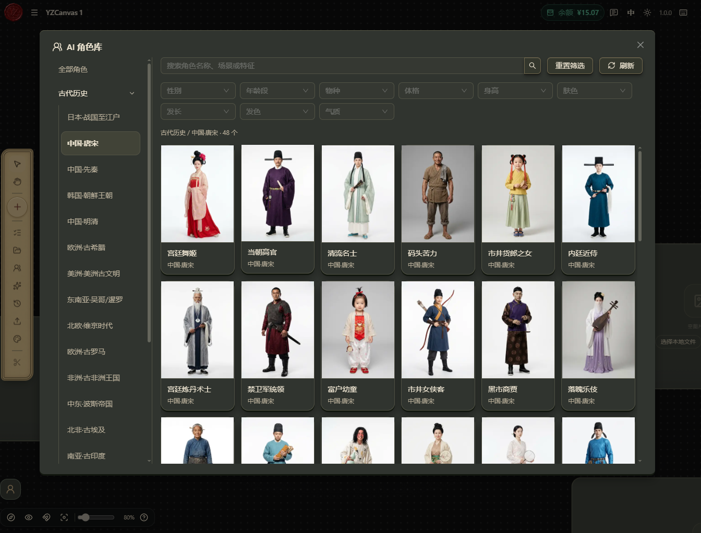
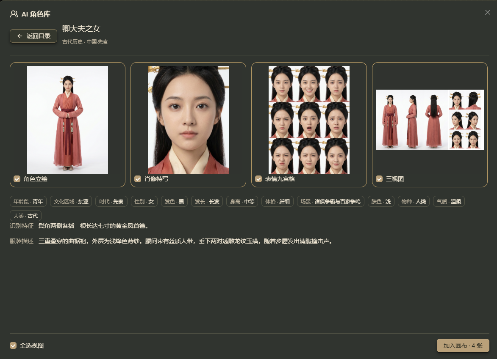
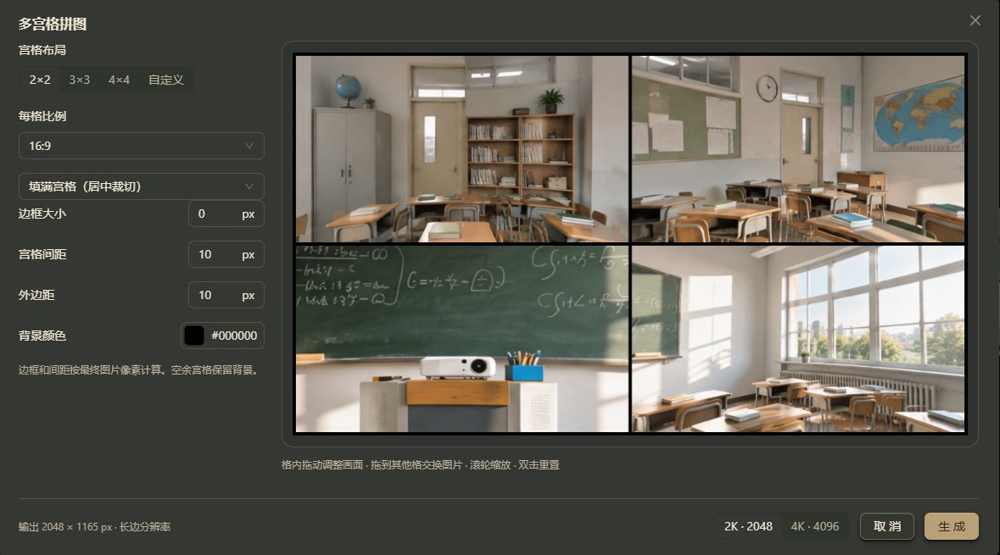
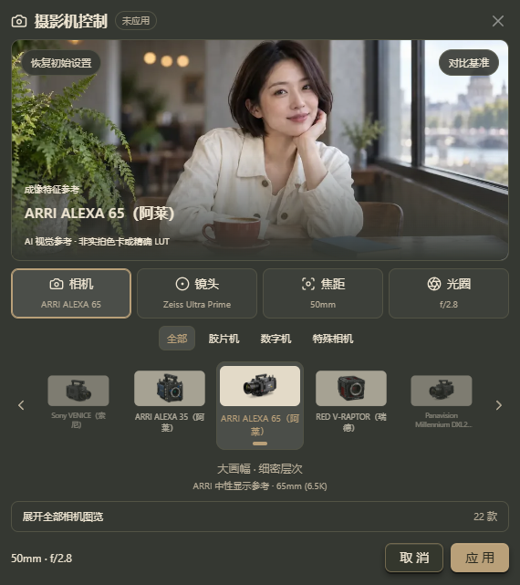
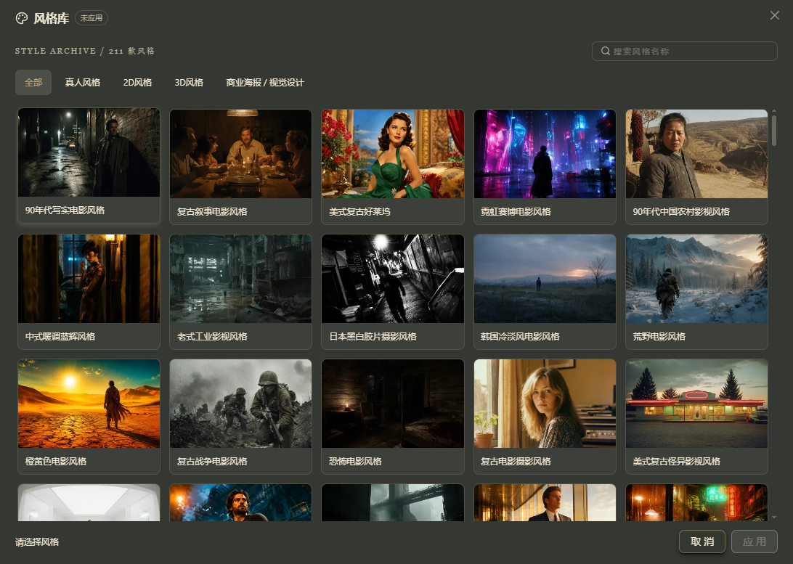

  

<h1 align="center">YZ-Ai-Studio</h1>

## YZCanvas · AI 无限画布

Windows 客户端发布、版本更新与使用说明。

### 当前版本：1.0.1

- [下载 Windows x64 安装包](https://github.com/YZ1989/YZ-Ai-Studio/releases/download/v1.0.1/YZCanvas_1.0.1_x64-setup.exe)
- [国内下载](https://downloads.yz-jinyu.cn/updates/YZCanvas_1.0.1_x64-setup.exe)
- [最新版本与历史安装包](https://github.com/YZ1989/YZ-Ai-Studio/releases)
- [版本更新记录](CHANGELOG.md)

## 获取更新

已接通在线更新的客户端可打开版本窗口，检查更新并下载安装。旧版也可下载完整安装包进行更新。本仓库提供 Windows x64 完整安装包，不是增量补丁。

安装前请保存工程，完成或停止正在运行的生成任务，并备份整个 Workspace 文件夹。工程管理支持选择并恢复原工程目录；重装系统前请保留该目录。

## 核心功能

- 无限画布：组织文本、图像、音频、视频与参考连线。
- 图像与视频生成，节点生成历史与版本切换。
- 金鱼AI 角色库、多视图预览及加入画布。
- 资产管理、提示词库与本地工程管理。

## 产品展示

以英伦复古风格打造的 AI 创作工作台，将画布、素材和创作工具汇集在一起。以下为 YZCanvas 1.0.0 客户端实机截图，点击图片可查看大图。

### 首页 · 深浅双主题

火漆印章、复古相框与胶片式画布卡片，搭配暗色和亮色主题。从首页即可进入画布、资产管理与提示词库。

### 资产管理

按人物、环境、道具、声音、视频等分类整理素材，支持搜索、新建、批量管理及导入导出，让常用资产随时可用。

### 音频剪辑台

直接在画布中查看音频波形，缩放选区、调整起止时间并循环试听，可保存选区或裁剪音频。

### AI 角色库

按时代、文化区域与角色特征查找参考人物，预览角色立绘、肖像特写、表情九宫格和三视图，并将选中的视图加入画布。

### 多宫格拼图

提供 2×2、3×3、4×4 及自定义布局，可调整比例、间距和背景，在预览中拖动、缩放与交换图片，生成 2K 或 4K 拼图。

### 摄影机预设

组合相机、镜头、焦距与光圈设置，浏览影像特征参考，为 AI 创作选择合适的镜头语言。

### 风格库

浏览真人、2D、3D、商业海报与视觉设计等风格，通过示例图快速选择创作方向，也可按名称搜索。

## 本次更新

- [调整] 视频节点恢复 Wan 分类，仅收录 Wan 3.0 标准版、Prime 高速版及国内 / 海外图生和参考视频模型，支持素材自动切换与参数校验。

- [新增] 视频节点同步金鱼最新 H3 OW 普通版、Fast 与音频驱动模型并独立分类，接入 FlashVSR / VOSR2 视频超分，更新素材限制、参数校验和价格。

- [调整] 视频节点分类统一命名为 Kling，仅保留 V3 与 O3 系列，移除 Vidu、HappyHorse 及 Wan 2.7 模型选项。

- [调整] 音频节点仅保留 Suno V6、V5.5、自定义音乐模型与 Doubao，新建音频节点固定默认 Doubao Seed Audio 1.0。

- [新增] 图像工具栏增加扩图，按目标比例与原图位置创建模糊底图和关联的图生图节点，自动准备方向提示词后选择模型生成。

- [优化] 图片详情改为全屏查看，压暗并模糊画布背景，支持拖动、滚轮缩放和重置视图。

- [调整] 移除音频和图像节点工具栏的替换按钮，以及自定义图像工具栏中的替换选项。

- [优化] 视频工具栏提取音频改为纯图标并紧接加入资产，移除替换视频工具按钮，下载视频置于末尾。

- [优化] 图像编辑调整操作间距、默认笔刷与圆点光标；全景图遵循工具栏文字开关，自定义工具栏下载项统一置后。

- [优化] 图像编辑工具栏改为单行并以垃圾桶清空当前层，绘制区支持滚轮缩放、手形移动及空格/中键平移。

- [修复] 角度立方体随鼠标方向旋转并恢复滚轮调节镜头距离；编辑器橡皮、裁剪与切分统一为连续图标按钮。

- [优化] 调整小地图避让账号入口；图像编辑增加形状、透明度和橡皮光标，集成裁剪切分并修复首屏空白；角度生成支持拖拽立方体与完整水平环绕，下载移至工具栏末尾。

- [调整] 客户端版本记录仅展示 1.0.0 及以后；发布工具在成功上线后按当前版本加最多十个历史版本清理 OSS 旧安装包和签名。

## 帮助与反馈

在客户端首页或画布右上角打开「问题反馈」，可以提交问题、查看处理状态与回复。

[金鱼AI](https://api.yz-jinyu.com/) · [作者 B站](https://space.bilibili.com/14843708) · [作者 YouTube](https://www.youtube.com/@jinyuze123)

## 仓库范围与许可

本仓库用于分发客户端安装包、更新签名、校验值与版本说明，不包含开发工作区、用户素材、账号凭据或签名私钥。

YZCanvas 基于 TDCanvas 开发。客户端包含的上游代码继续适用 AGPL-3.0；发布仓库不改变原许可证及相关权利，许可证见 [LICENSE](LICENSE)。
